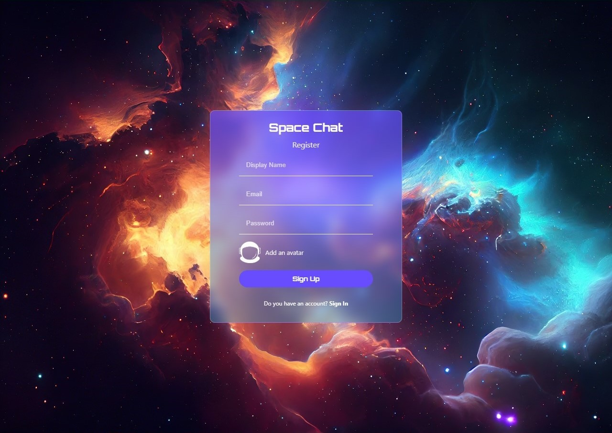

# Space Chat - Real-time Chat Application

Space Chat is a modern, real-time chat application built with React and Firebase. It offers a sleek, space-themed user interface for seamless communication.

## Features

- Real-time messaging
- User authentication
- Space-themed UI
- Emoji support
- Image sharing
- Message timestamps
- User online/offline status

## Technologies Used

- React.js
- Firebase (Authentication, Firestore, Storage)
- CSS3 for styling

## Getting Started

These instructions will get you a copy of the project up and running on your local machine for development and testing purposes.

### Prerequisites

- Node.js (v14.0.0 or later)
- npm (v6.0.0 or later)

### Installation

1. Clone the repository
2. Navigate to the project directory
3. Install dependencies
4. Create a `.env` file in the root directory and add your Firebase configuration
5. Start the development server

The application should now be running on [http://localhost:3000](http://localhost:3000).

## Usage

1. Sign up for an account or log in if you already have one.
2. Click on a user in the sidebar to start a chat.
3. Type your message and press send or use the attachment button to send images.
